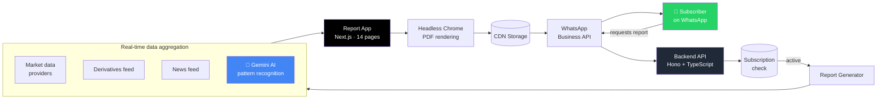

# Market Saarthi

> **Your daily co-pilot for the Indian markets.** Pre-market intelligence, delivered to WhatsApp before the bell rings.

🌐 **Website:** [marketsarathi.com](https://marketsarathi.com/) &nbsp;•&nbsp; 📄 **[View a sample report](./assets/sample-report.pdf)**

---

## What is Market Saarthi?

Market Saarthi (*"saarthi"* — guide, in Hindi) is a production-grade market intelligence service that delivers a 14-page, AI-augmented pre-market report to subscribers on WhatsApp every trading day.

No app to install. No dashboard to log into. Just a message.

It is built for Indian retail traders, swing traders, and serious investors who want a structured, opinionated read on the market *before* the open — sentiment, sectors, derivatives, IPOs, technical patterns, global cues — without the noise.

---

## Why it exists

Indian retail traders are flooded with information but starved of structure. Telegram channels, Twitter threads, broker emails, news apps — none of them tell you *what matters today* before the market opens.

Market Saarthi solves one job, well:

> **A single, beautifully-formatted document, in your WhatsApp inbox, every trading morning, that tells you what to watch and why.**

---

## What's inside the daily report

A 14-page, A4-formatted PDF covering:

- **Market Sentiment** — Fear & Greed gauge, India VIX, advance/decline
- **Index Snapshot** — Nifty 50, Bank Nifty, Sensex with key levels
- **Global Cues** — overnight Asia/US markets, Dow, Nasdaq, crude, dollar index
- **Sector Heatmap** — winners and laggards across NSE sectors
- **Top Movers** — gainers, losers, volume shockers
- **Derivatives Outlook** — F&O open interest, PCR, max pain
- **AI Pattern Recognition** — technical chart patterns auto-detected on NSE stocks (Double Bottom, Head & Shoulders, Wedges, etc.) with explanations
- **Institutional Flows** — FII/DII activity
- **IPO Watch** — upcoming and currently-open issues
- **News Digest** — stock-moving headlines from overnight

📄 [**See a real sample → assets/sample-report.pdf**](./assets/sample-report.pdf)

---

## How it works

### End-to-end flow

1. **Trigger** — Subscriber pings the Market Saarthi WhatsApp number.
2. **Authenticate** — Backend validates active subscription, checks the daily-report cache.
3. **Aggregate** — Real-time data is pulled from multiple institutional market-data providers (indices, sectors, derivatives, sentiment, news, IPOs).
4. **Analyze** — Gemini AI scans NSE charts for technical patterns and generates plain-English commentary.
5. **Render** — A dedicated Next.js report app renders all 14 pages with charts, gauges, and tables.
6. **Snapshot** — Headless Chrome (Puppeteer) captures the rendered app as a print-perfect PDF.
7. **Deliver** — PDF is uploaded to a CDN, then sent through the WhatsApp Business API as a templated message.
8. **Track** — Every delivery is logged. Failures auto-retry. Subscription expirations trigger lifecycle messages.

A scheduled cron job runs the same pipeline once per trading morning to broadcast the report to the entire active subscriber base — generated **once**, fanned out to **everyone**.

---

## Tech stack

| Layer | Stack |
|---|---|
| **Backend API** | Node.js · TypeScript · [Hono](https://hono.dev) |
| **Database** | PostgreSQL via Supabase |
| **Storage / CDN** | Supabase Storage |
| **Report rendering** | Next.js 15 · React 19 · Tailwind CSS v4 |
| **Charting** | AG Charts · Chart.js · Recharts (server-side via `chartjs-node-canvas`) |
| **PDF generation** | Puppeteer (headless Chromium) |
| **AI / LLM** | Google Gemini via Vercel AI SDK |
| **Messaging** | WhatsApp Business API (WATI) |
| **Payments** | PhonePe (UPI) |
| **Scheduling** | Cron-driven daily jobs with retry queue |
| **Deployment** | Docker · Vercel |

📂 [**Full tech-stack rundown → docs/tech-stack.md**](./docs/tech-stack.md)
🏗️ [**Deep-dive architecture → docs/architecture.md**](./docs/architecture.md)

---

## Reliability & engineering notes

This is not a weekend project. A daily-delivery product earns trust by *not* missing a day.

- **99% delivery rate** across the active subscriber base.
- **Idempotent generation** — the day's PDF is generated once and reused for every recipient; webhooks dedupe by date.
- **Fast-ack webhooks** — inbound WhatsApp webhooks return `200 OK` immediately and process in the background, so the upstream provider never times out.
- **Delivery tracking** — every send is recorded in a `report_deliveries` table with status, provider response, and error trace.
- **Automatic retries** — a separate cron sweeps failed deliveries and reattempts with backoff.
- **Subscription lifecycle** — expiring subscriptions get a one-shot reminder template (idempotent via a `expiry_notified_at` flag) so users are never re-spammed.
- **Container-portable** — backend ships as a Docker image with Chromium and required fonts pre-installed; runs on any cloud.

---

## Repository structure

The product is composed of three private repositories. This public repo is a showcase only — source code is not open.

| Repo | Role |
|---|---|
| **`market-sarathi-backend`** | Hono API · data aggregation · cron jobs · WhatsApp delivery · payment webhooks |
| **`market-sarathi-report`** | Next.js app that renders the 14-page report (rendered to PDF by the backend) |
| **`market-sarathi-frontend`** | Public-facing landing & report viewer |

---

## License

**Proprietary — All rights reserved.** This repository is provided for showcase purposes only. The Market Saarthi name, brand, source code, content, and report design are the property of the author. No part of this project may be copied, modified, or redistributed without written permission.

See [LICENSE](./LICENSE).

---

## Author

**Bhuvanesh Dorle**
📧 [bhuvaneshdorle@gmail.com](mailto:bhuvaneshdorle@gmail.com)
🌐 [marketsarathi.com](https://marketsarathi.com/)

---

Built in India 🇮🇳, for Indian markets.
